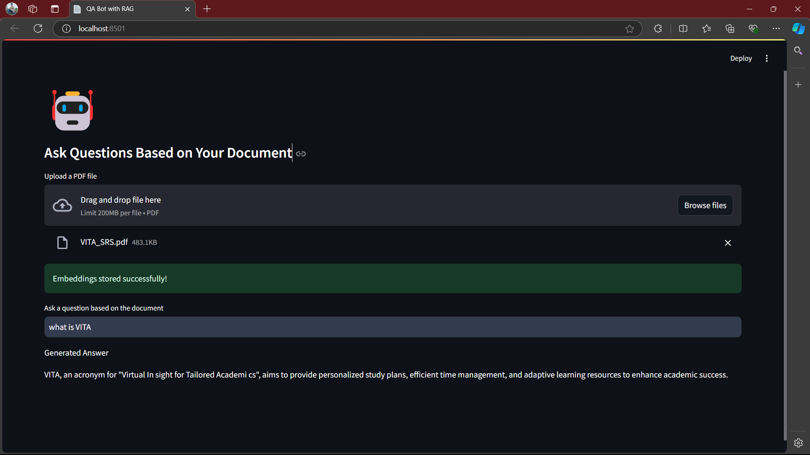

# Document-based Question Answering Bot with RAG

This repository contains the code and resources for a Retrieval-Augmented Generation (RAG) based Question Answering (QA) bot. The QA bot leverages a vector database (Pinecone) for efficient retrieval of relevant document embeddings and uses Cohere's generative model to provide coherent answers based on the retrieved information.


## Overview

The project focuses on building an interactive QA bot that allows users to upload PDF documents and ask questions based on the content of those documents. The system employs a RAG model to enhance the QA capabilities by retrieving relevant information from the documents and generating accurate responses.

## Project Structure

The project is organized into a modular structure to ensure scalability and maintainability:

### Main Files
`Part1.ipynb`: This is a colab notebook only for part1 of the task with detaied approach, direct link for colab notebook: https://colab.research.google.com/drive/1W1Uy-v_WTtJZf112P4R6yAgme5tgWTw1?usp=sharing

`main.py`: This is for part 1 and 2 conbined without the project structure, you can run run the file using streamlit run
```bash
streamlit run app.py
```
## Preview


### File Descriptions

- **`app.py`**: The main Streamlit application that orchestrates the workflow by importing and utilizing functions from other modules. It handles user interactions, such as uploading PDFs and inputting queries.

- **`config.py`**: Contains all configuration variables, including API keys and environment settings. This centralizes configuration management, making it easier to update and maintain.

- **`src/document_processor.py`**: Houses functions for reading PDF files and splitting the extracted text into manageable chunks for embedding.

- **`src/embedding_handler.py`**: Includes functions to create and normalize embeddings using Cohere's API. This module ensures that the text data is properly vectorized for efficient storage and retrieval.

- **`src/pinecone_manager.py`**: Manages all interactions with Pinecone, including storing embeddings and performing similarity searches based on user queries.

- **`src/query_handler.py`**: Handles the processing of user queries by retrieving relevant document chunks from Pinecone and generating answers using Cohere's generative model.

- **`src/utils.py`**: Contains utility functions, such as displaying emojis in the Streamlit app for enhanced user experience.

- **`Dockerfile`**: Defines the Docker image configuration for containerizing the application, ensuring consistent environments across different deployments.

- **`requirements.txt`**: Lists all Python dependencies required to run the project. This facilitates easy installation of necessary packages.

## Getting Started

To get started with the project, follow these steps:

### 1. Clone the Repository

Clone this repository to your local machine:

```bash
git clone https://github.com/RiteshYennuwar/PDF_RAG_Task.git
cd PDF_RAG_Task
```
### 2. Set Up Configuration
Create a .env file in the root directory and add your API keys:
```bash
PINECONE_API_KEY=your_pinecone_api_key
PINECONE_ENV=your_pinecone_environment
COHERE_API_KEY=your_cohere_api_key
```
### 3. Install Dependencies
Install the required Python packages using pip:
```bash
pip install -r requirements.txt
```
### 4. Run the Streamlit Application
Start the Streamlit app by running:
```bash
streamlit run app.py
```
After running the command, navigate to http://localhost:8501 in your web browser to access the application.

### Usage
1. Upload PDF: Click on the "Upload a PDF file" button to upload your document. The app will extract and display the first 1000 characters of the text for preview.

2. Ask a Question: Enter your query in the input field. The app will retrieve the most relevant document chunks from Pinecone and generate an answer using Cohere's generative model.

3. View Results: The generated answer and the relevant document sections will be displayed for your reference.

## Docker Setup
To containerize the application and run it using Docker, follow these steps:

### 1. Build the Docker Image

Ensure you have Docker installed on your machine. Then, build the Docker image with the following command:
```bash
docker build -t qa-bot-rag-app .
```
### 2. Run the Docker Container
Run the Docker container, mapping the appropriate ports:
```bash
docker run -p 8501:8501 qa-bot-rag-app
```
### 3. Access the Application
Navigate to http://localhost:8501 in your web browser to access the Streamlit application running inside the Docker container.